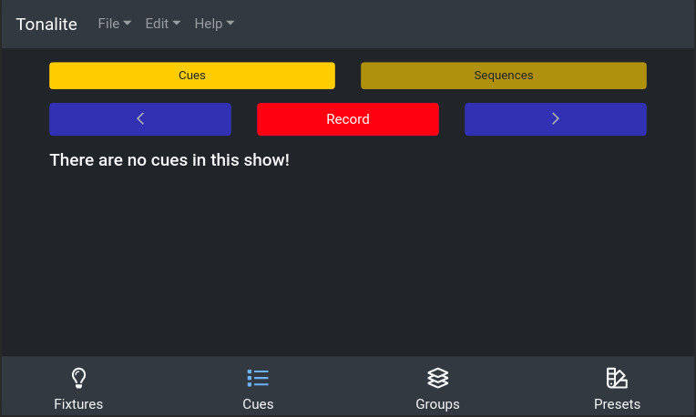
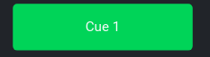
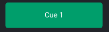
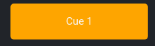

# Using Cues

During a production, you will have a different lighting setup for almost every scene. You can create cues and transition between them to serve this purpose. You can find the options for cues in the `Cues` > `Cues` sub-tab.

## Display

### Inactive

A cue item displays as a green box with the cue's name inside by default. This is also the state for an inactive cue.

### Active

The color of a cue box will change to a darker green after it has been run to show that it is the active (or last cue).

### Running

While a cue is running, the color of the box will change to a yellow color. It will switch to the darker green, active state when finished.

