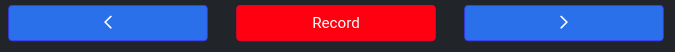
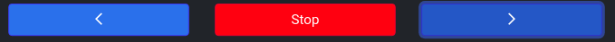
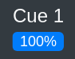

# Moving Between Cues

You can transition between cues using the buttons at the top of the `Cues` > `Cues` sub-tab.

## Left

Transition to the cue directly before the current (last-played) cue. If no cue has been played, or the last cue played was the first in the list, the last cue in the list will be played.

## Right

Transition to the cue directly after the current (last-played) cue. If no cue has been played, or the last cue played was the last in the list, the first cue in the list will be played.

## Stop

When a cue is running, the `Record` button will switch to a `Stop` button. Press this to stop the currently running cue.

## Cue Progress

In the header on the right is a display of the progress of the current cue. a display if `100%` means that the current cue has gotten to the end, `0%` means that the cue has not started yet. This display updates in realtime as cues are running.