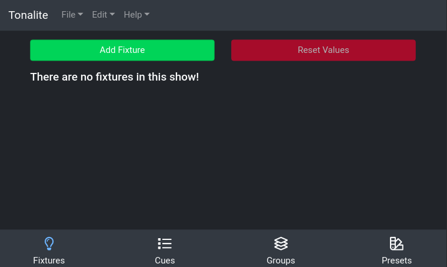
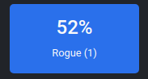
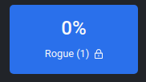
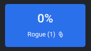

# Using Fixtures

Any production uses a number of different lighting fixtures. Tonalite allows you to control each one individually and set the values of each of its parameters separately. You can access the fixtures in the `Fixtures` tab of the interface.

## Display

A fixture item displays as a blue box with the fixture's name inside.

### Special Displays

#### Intensity

If a fixture has an intensity parameter, the value of that parameter will be displayed along with the fixture's name.

#### Locked Channels

If a fixture has any locked channels, an icon will appear next to its name to indicate this.

#### Active Effects

If a fixture has any active effects, an icon will appear next to its name to indicate this.

