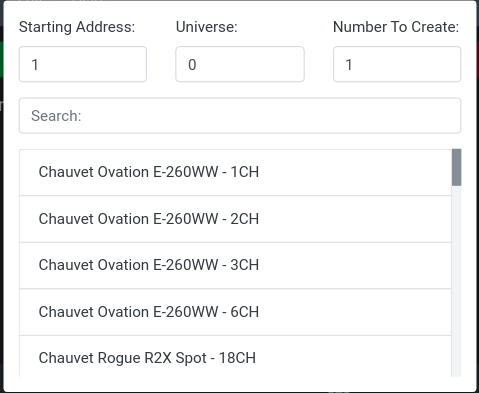
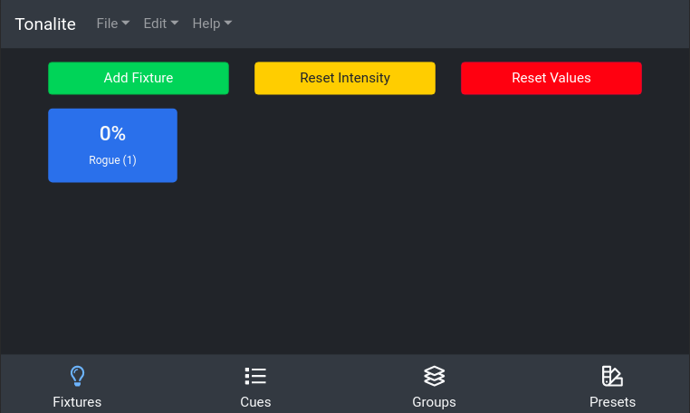

# Adding Fixtures

Add a fixture using the green `Add Fixture` button on the top of the `Fixtures` tab. This will open a modal that shows the available fixture profiles and allows you to set a starting DMX address for the soon to be created fixture. Each of a fixtures's parameters' DMX addresses is based on the `Starting Address` and `Universe` fields. If the fixture has three parameters and the starting DMX address is 1, the parameters will be mapped to addresses 1, 2, and 3. Use the `Number To Create` field to specify how many of this type of fixture you would like to create.

To select a fixture profile, navigate through the manufacturers and models to find the correct mode. Click on it in the list, and a new fixture will be created based on this profile. If you can't find what you are looking for, try using the `Search` box. If there isn't a profile in the library for the fixture you want to use, you can create one yourself or send a support message asking for one to be created for you.

