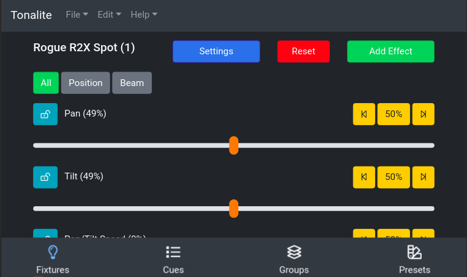

# Updating Fixture Parameters

Each of a fixture's parameters can be controlled individually. To access the fixture parameters page, click on the appropriate fixture in the `Fixtures` tab.

## Top Bar

### Settings

Go to this fixture's settings.

### Reset

Reset the parameter values for this fixture. You will be asked to make sure you want to do this because this will cause a blackout in most cases.

### Add Effect

Add an effect that will run on this fixture.

## Category Buttons

### All

Display all available parameters on this fixture.

### Position

Display only the position parameters on this fixture.

### Color

Display only the color parameters on this fixture.

### Beam

Display only the beam parameters on this fixture.

## Parameter Buttons

There are some buttons that show up on all parameters.

### Lock

Besides each parameter, there is a lock icon. It switches from unlocked to locked when you click on it. When a parameter is locked, the value you set manually on the slider will override values for the parameter that are saved in cues.

### Left

Set this parameter's value to 0%.

### 50%

Set this parameter's value to 50%;

### Right

Set this parameter's value to 100%;
