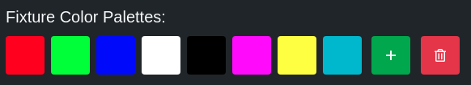
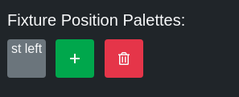

# Updating Fixture Parameters

Each of a fixture's parameters can be controlled individually. To access the fixture parameters page, click on the appropriate fixture in the `Fixtures` tab.

## Top Bar

### Settings

Go to this fixture's settings.

### Reset

Reset the parameter values for this fixture. You will be asked to make sure you want to do this because this will cause a blackout in most cases.

### Add Effect

Add an effect that will run on this fixture.

## Category Buttons

### All

Display all available parameters on this fixture.

### Position

Display only the position parameters on this fixture.

### Color

Display only the color parameters on this fixture.

### Beam

Display only the beam parameters on this fixture.

## Parameter Buttons

There are some buttons that show up on all parameters.

### Lock

Besides each parameter, there is a lock icon. It switches from unlocked to locked when you click on it. When a parameter is locked, the value you set manually on the slider will override values for the parameter that are saved in cues.

### Left

Set this parameter's value to 0%.

### 50%

Set this parameter's value to 50%;

### Right

Set this parameter's value to 100%;

## Color Palettes

There are a number of different color palettes available. Click one in the list to apply it to the fixture. Tonalite currently supports the following color mixing modes natively:

- RGB
- RGBW
- RGBA
- RGBAW
- CMY
- HSI

If a fixture has one of these color mixing modes, Tonalite will use all of its color parameters to set the correct color from the palette. If a fixture does not have one of these modes, Tonalite will attempt to set RGB parameter values if any of those parameters exist on the fixture, or else will fail to apply the color palette.

### Add Palette

To add a palette, click the green button with a plus sign inside of it. You will be asked to choose a name for the new palette.

### Remove Palette

To remove a palette, click the red button with a lock inside of it. The palettes that can be removed will start pulsing. To remove one, click on it in the list. You will be asked if you are sure you want to remove it.

## Position Palettes

You can create position palettes to apply to your fixtures. Click on one in the list to apply it to the fixture. These set the pan and/or tilt parameters of a fixture.

### Add Palette

To add a palette, click the green button with a plus sign inside of it. You will be asked to choose a name for the new palette.

### Remove Palette

To remove a palette, click the red button with a lock inside of it. The palettes that can be removed will mstart pulsing. To remove one, click on it in the list. You will be asked if you are sure you want to remove it.
