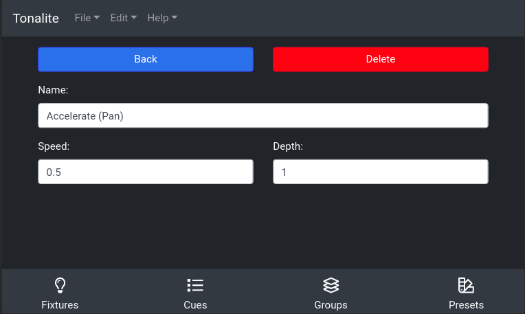

# Changing Effect Settings

You can change various settings of an effect.
You can access an effect's setting page by clicking the `Settings` button on the effects's display row on a fixture's parameters page.

## Buttons

### Back

Go back to the fixture's parameters.

### Delete

Remove the effect from the show. You will be prompted to make sure you want to do this.

## Inputs

### Name

The full name of the effect. This can be any length needed to be descriptive.

### Speed

A multiplier for the speed of the effect.

### Depth

How much this effect affects the fixture that it is applied to. Depth is in a range of `0.0` to `1.0` where `0.0` is the least effect, and `1.0` means that this effect completely overrides the values from the fixture. If depth is between `0.0` and `1.0`, the values of the effect and the values of the fixture are mixed. This is useful when used on shape effects to scale the shape produced to fit your stage.