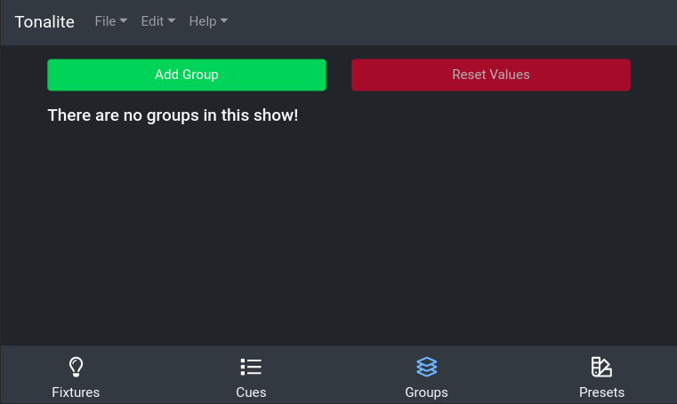
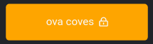

# Using Groups

You can control the parameters of multiple fixtures at the same time by using groups. Groups can be accessed in the `Groups` tab of the interface.

## Display

A group item displays as a yellow box with the group's name inside.

### Special Displays

#### Locked Channels

If a group has any locked channels, an icon will appear next to its name to indicate this.

