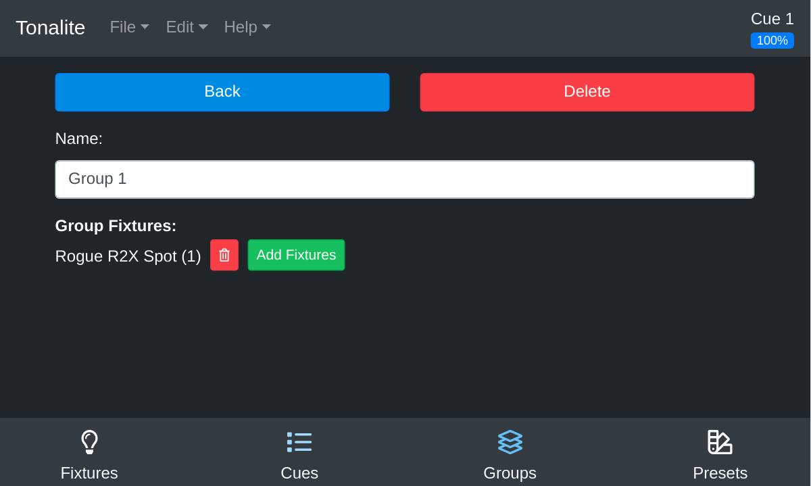

# Changing Group Settings

You can change the various settings of a group.
You can access a group's setting page by clicking the `Settings` button on the group's parameters page.

## Buttons

### Back

Go back to the group's parameters.

### Delete

Remove the group from the show. You will be prompted to make sure you want to do this.

## Inputs

### Name

The full name of the group. This can be any length needed to be descriptive though you should keep it short enough to fit into the interface easily.
