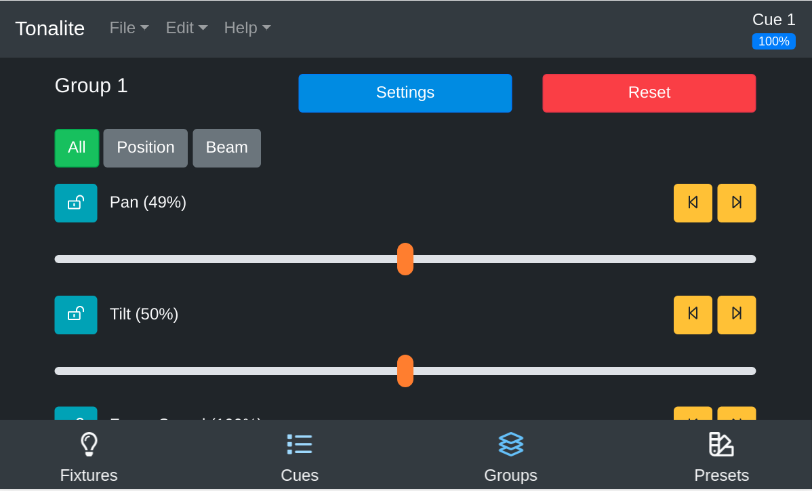

# Updating Group Parameters

Each of the groups's parameters can be controlled individually. To access the group parameters page, click on the appropriate group in the `Groups` tab.

## Top Bar

### Settings

Go to this fixture's settings.

### Reset

Reset the parameter values for this group. You will be asked to make sure you want to do this because this will cause a blackout in most cases.

## Category Buttons

### All

Display all available parameters on this group.

### Position

Display only the position parameters on this group.

### Color

Display only the color parameters on this group.

### Beam

Display only the beam parameters on this group.

## Parameter Buttons

There are some buttons that show up on all parameters.

### Lock

Besides each parameter, there is a lock icon. It switches from unlocked to locked when you click on it. When a parameter is locked, the value you set manually on the slider will override values for the parameter that are saved in cues.

### Left

Set this parameter's value to 0%.

### 50%

Set this parameter's value to 50%;

### Right

Set this parameter's value to 100%;

