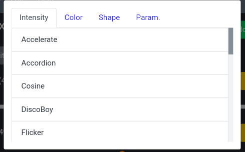
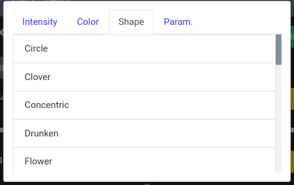
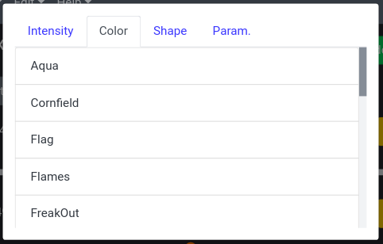
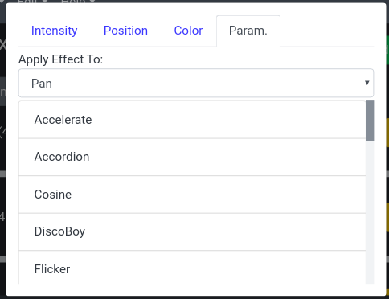

# Adding Effects

Add an effect to the current group by using the green `Add Effect` button on the top of the group's parameters view. This will open a modal that shows the available effect categories. You can select a category and it will display all the effects available for that category.

## Intensity

Intensity effects control the intensity values of a group's fixtures. If an intensity parameter does not exist on the group, this category will not be displayed.

## Position

Position effects control the pan and tilt values of a group's fixtures (X and Y). If only the pan or tilt parameter exists on the group, it will still be affected by itself. If a position parameter does not exist on the group, this category will not be displayed.

## Color

Color effects control the RGB values of a group's fixtures. If more parameter colors than just RGB exist, they will not be affected. If only the R, G, or B parameters exist on the group, they will still be affected by themselves. If a color parameter does not exist on the group, this category will not be displayed.

## Param.

Parameter effects can control any parameter of a group's fixtures.

### Apply Effect To

Use the dropdown to select which of this group's parameters to apply the effect to.