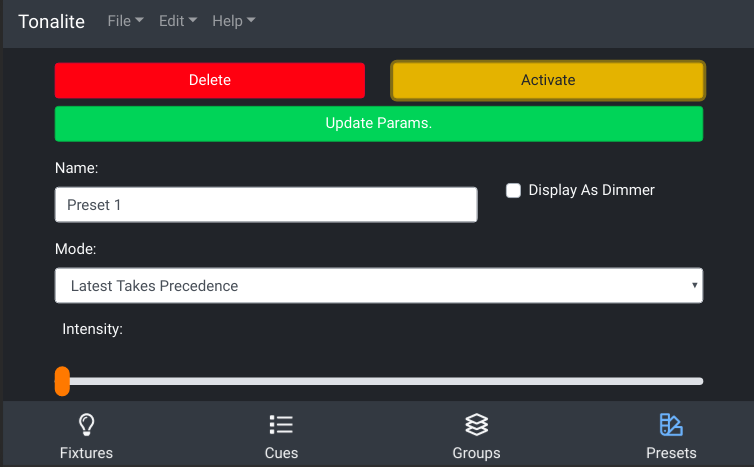
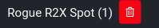
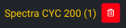

# Changing Preset Settings

You can change the various settings of a preset.
You can access a preset's setting page by clicking on a preset item in the `Presets` page.

## Top Bar

### Delete

Remove the preset from the show. You will be prompted to make sure you want to do this.

### Activate

Active the current preset. When activated, this button will switch to `Deactivate` which does the opposite.

### Update Params

Update the values that are stored in thie preset.

## Inputs

### Name

The full name of the preset. This can be any length needed to be descriptive though you should keep it short enough to fit into the interface easily.

### Display As Dimmer

Display the preset as a dimmable value rather than as an on/off button in the interface.

### Mode

The overide mode that the preset is in.

Options:

- `Latest Takes Precedence` - This preset will overide everything
- `Highest Takes Precedence` - This preset will ovveride everything when its values are higher

Default: `Latest Takes Precedence`

The default can be updated in settings.

### Intensity

Control the overall intensity of this preset.

### Preset Fixtures

This is a list of each fixture that belongs to a preset.

If the fixture in the preset does not exist in the current show, it will be displayed in yellow.

#### Delete

Use this button to remove the fixture from the preset. If the deleted fixture was the last in the preset, the preset will be deleted because it is now empty.

#### Add Fixtures

Add fixtures to be controlled by this preset. The added fixtures will be recorded with their current values.