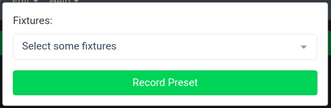
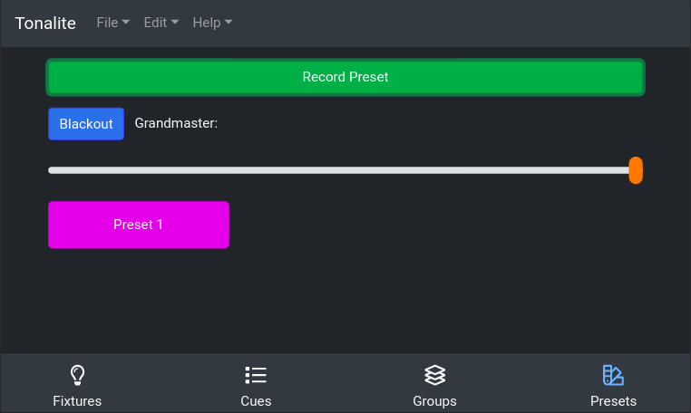

# Recording Presets

Record a preset using the green `Record Preset` button on the top of the `Presets` tab. This will open a modal that shows the available fixtures in the show and allows you to select which ones you would like to control with this preset.

To select a fixture, click on it in the list, and the new group will control this fixture along with any others you select. You can select multiple on this list.

