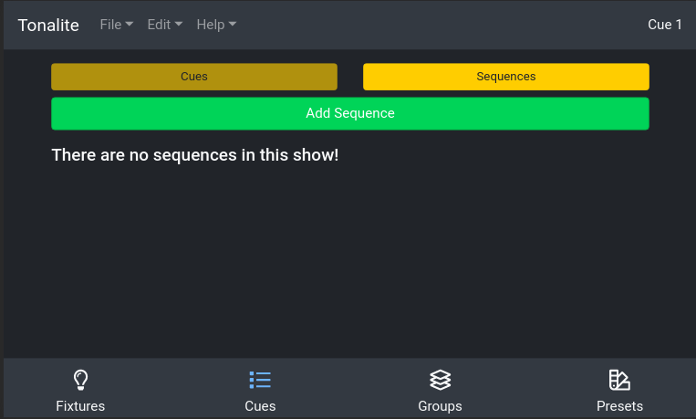
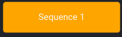

# Using Sequences

Tonalite has a number of built-in effects for fixtures, but sequences allow you to create your own effects and create effects that can control multiple fixtures at once. Sequences are created using steps and this makes them great for programming chases and other related movements. You can find the options for sequences in the `Cues` > `Sequences` sub-tab.

## Display

### Active

Active sequences display as a yellow box with the sequence's name.

### Inactive

Inactive sequences display as a yellow box with the sequence's name.

