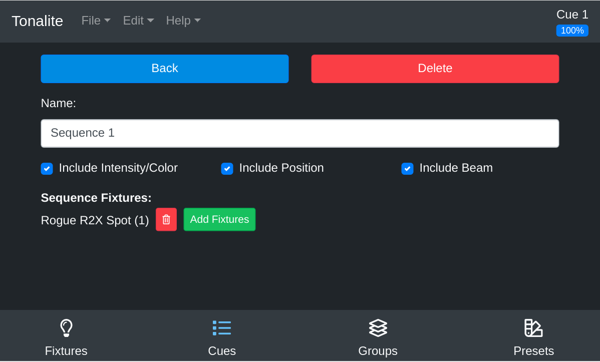

# Changing Sequence Settings

You can access the settings for a sequence by clicking the `Settings` button on the sequence's steps page.

## Top Bar

### Back

Go back to the sequence's `Steps` view.

### Delete

Remove this sequence from the show. You will be prompted to make sure that you really want to do this.

## Inputs

### Name

The name of the sequence. You can use this to describe when the sequence should be run.

### Include Intensitity/Color

Allow this sequence to control the intensity and color parameters of fixtures.

### Include Position

Allow this sequence to control the position parameters of fixtures.

### Include Beam

Allow this sequence to control the beam parameters of fixtures.

### Sequence Fixtures

This is a list of each fixture that belongs to a sequence.

#### Delete

Use this button to remove the fixture from the sequence. If the deleted fixture was the last in the sequence, the sequence will be deleted because it is now empty.