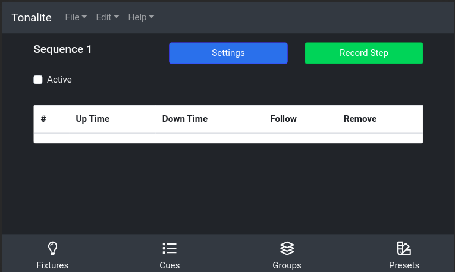
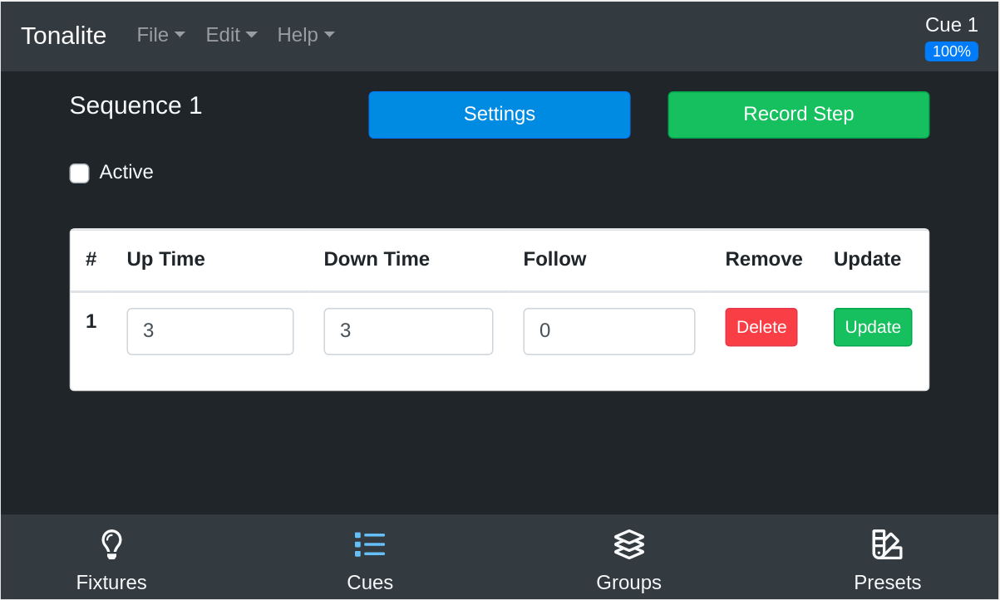
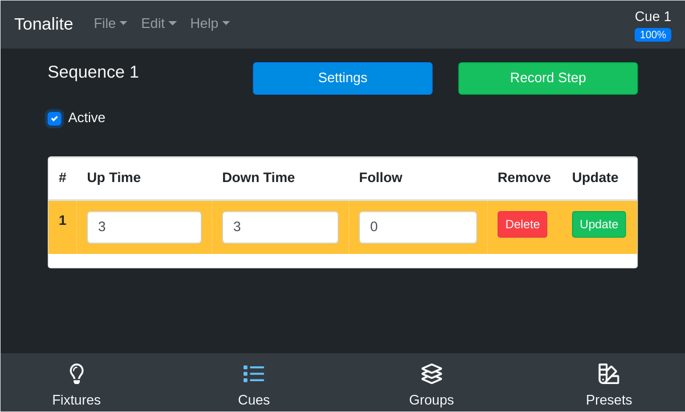

# Updating Sequence Steps

Each sequence is made up of a number of steps. To access the sequence steps page, click on the appropriate sequence in the `Cues` > `Sequences` sub-tab.

## Top Bar

### Settings

Go to this sequence's settings.

### Record Step

Add a step to the sequence.

## Active

Activate or deactive the current sequence. If the sequence is active, the current step of the sequence will be highlighted in yellow.

## Step Settings

### Up Time

The time it takes for fixture values to change between steps if they are increasing.

### Down Time

The time it takes for fixture values to change between steps if they are decreasing.

### Follow

Once the step has been run, the step following it will be run after the time specified here (in seconds).

### Remove

Remove this step from the sequence. You will be prompted to make sure that you want to do this.

### Update

Update this step to use the current values of the show's fixture parameters.
